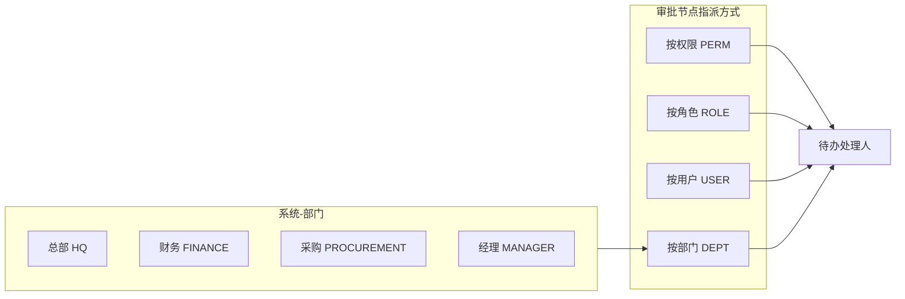
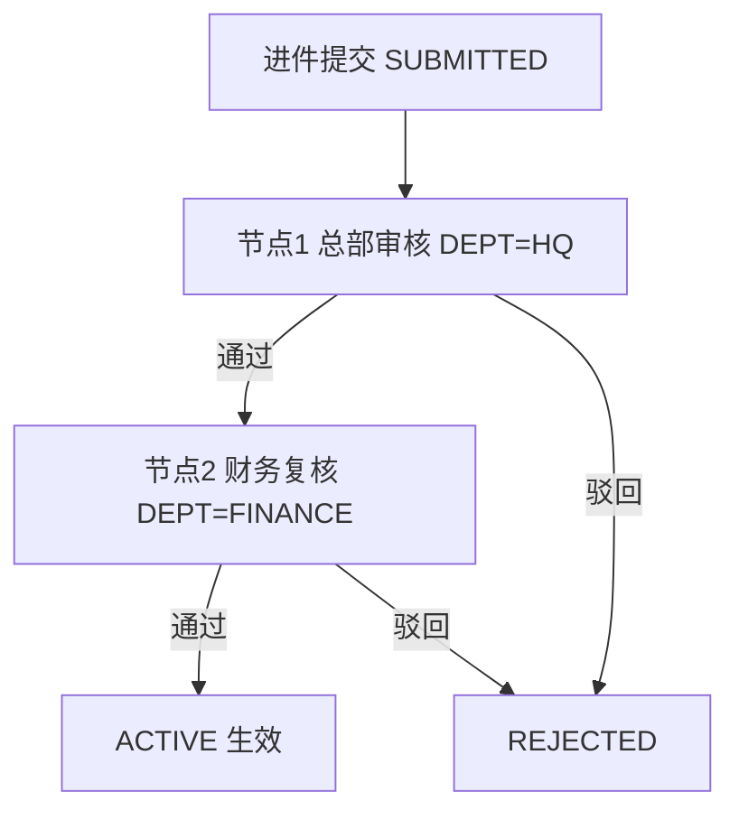
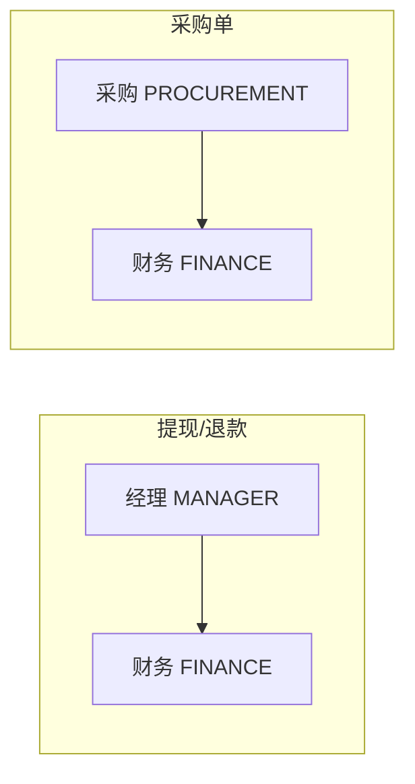

# 部门 × 审批流关系图

运营后台通过 **系统 → 部门管理** 与 **系统 → 审批流配置**，把审批节点指派到部门（或权限/角色/用户）。只有对应成员才会收到待办并有权通过/驳回。

## 1. 谁能审批

规则：**部门成员**，或节点上配置的 **权限 / 角色 / 指定用户**，才会收到待办并有权点通过/驳回。

| 指派类型 | `assignee_value` 含义 | 解析来源 |
|----------|----------------------|----------|
| `DEPT` | `ops_department.dept_key`（如 `HQ`、`FINANCE`） | `ops_user_department` |
| `PERM` | 权限码（如 `ops:replenishment:edit`） | 拥有该权限的运营账号 |
| `ROLE` | `role_key`（如 `finance`） | 拥有该角色的运营账号 |
| `USER` | `user_id` | 指定用户 |

## 2. 进件审批（已接通）

业务类型：`MERCHANT_ONBOARD`。提交后不可手工改成 `ACTIVE`，须走完审批。

演示账号：`13900000001` → 总部/采购/经理；`13900000002` → 财务。详见 [DEMO_ACCOUNTS.md](DEMO_ACCOUNTS.md)。

## 3. 其它业务默认节点（可在「审批流配置」改）

| 业务 | `biz_type` | 默认路径 |
|------|------------|----------|
| 商户进件 | `MERCHANT_ONBOARD` | 总部 → 财务 |
| 商户提现 | `MERCHANT_WITHDRAW` | 经理 → 财务 |
| 线长提现 | `LINE_WITHDRAW` | 经理 → 财务 |
| 余额退款 | `BALANCE_REFUND` | 经理 → 财务 |
| 采购单 | `PURCHASE_ORDER` | 采购 → 财务 |
| 商户要货 | `MERCHANT_REPLEN_REQUEST` | 按权限配置（默认可为 `PERM`） |
| 商户调账通知 | `MERCHANT_WALLET_ADJUST` | 按角色配置（默认可为 `ROLE=finance`） |

## 4. 后台入口

| 入口 | 路径 | 权限 |
|------|------|------|
| 部门管理 | `/departments` | `ops:dept:list` / `ops:dept:edit` |
| 审批流配置 | `/approvals` | `ops:approval:config`（**节点流程图**：开始 → 审批节点卡片 → 通过/驳回，可插入/上下移） |
| 顶栏待办 | `OpsApprovalInbox` | `ops:approval:list`（按钮权限，无独立菜单 path；勿与配置页 `/approvals` 混淆） |

登录后顶栏 **待办** 可跳到对应业务页（进件 `/merchant-onboarding`、采购 `/warehouse?tab=purchase`、提现 `/merchant-withdraw` 等）。

更多审批关系、以及与若依权限模型的差异（交易数据仍用商户/设备范围）见 [RBAC_VS_RUOYI.md](RBAC_VS_RUOYI.md)。

## 5. 相关代码

- 迁移：`V228`～`V231`（审批引擎、业务扩展、部门与进件）
- 服务：`ApprovalWorkflowService`、`DepartmentService`、`MerchantOnboardingService`
- 管理端：`DepartmentManageView.vue`、`ApprovalConfigView.vue`、`MerchantOnboardingView.vue`
